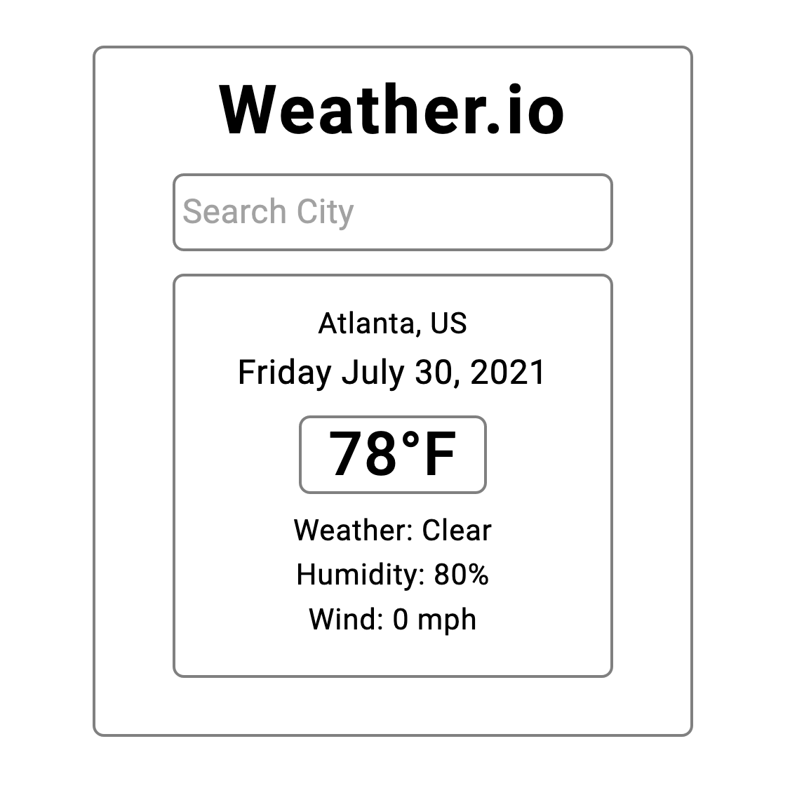

# Weather.io - A Simple React.js Weather App

## Table of contents

- [Overview](#overview)
  - [Screenshot](#screenshot)
  - [Links](#links)
- [My process](#my-process)
  - [Built with](#built-with)

## Overview

Users should be able to:

- View the optimal layout for the site depending on their device's screen size
- Enter city and receive data from OpenWeatherMap API

### Screenshot

### Links

- Solution URL: [https://github.com/hebree123/weather-app](https://github.com/hebree123/weather-app)
- Live Site URL: [https://hebree123.github.io/signup-form-master/](https://hebree123.github.io/signup-form-master/)

## My process

- Used React.js to create component structure
- Imported OpenWeatherMap API and weaved functionality into component
- Styled using Material UI

### Built with

- React.js
- Material UI
- OpenWeatherMap Forecast API
- ESLint
- Prettier
- Mobile-first workflow
